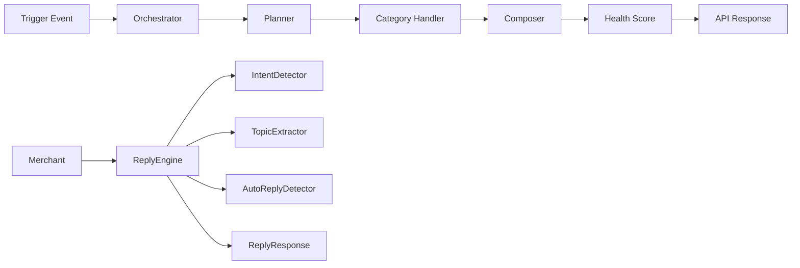

# 🚀 MagicPin Vera Bot


> **Deterministic Context-Aware Merchant Engagement Engine**

Submitted for the **MagicPin Vera Bot Challenge**

---

# 🌐 Live Demo

### Railway Deployment

**https://magicpin-bot-production-29a4.up.railway.app**

### Swagger Documentation

**https://magicpin-bot-production-29a4.up.railway.app/docs**

### OpenAPI Specification

**https://magicpin-bot-production-29a4.up.railway.app/openapi.json**

---

# 📌 Overview

MagicPin Vera Bot is a modular FastAPI application that generates personalized merchant engagement messages from business triggers and intelligently responds to merchant replies.

Unlike a generic chatbot, the system is **deterministic**. Every output is generated through explainable business logic using a planner-handler architecture, ensuring consistency, traceability and predictable behavior.

The project supports:

* proactive trigger processing
* merchant reply understanding
* contextual message composition
* health scoring
* suppression keys
* robust edge-case handling

---

# ✨ Features

* Deterministic response generation
* Context-aware merchant messaging
* Modular trigger handlers
* Reply intent detection
* Auto-reply detection
* Topic extraction
* Health score calculation
* Suppression key generation
* Railway deployment
* Interactive Swagger documentation
* Comprehensive edge-case validation

---

# 🏗 Architecture



---

# 📂 Project Structure

```text
magicpin-bot/

│
├── app.py
│
├── core/
│   ├── orchestrator.py
│   ├── planner.py
│   ├── composer.py
│   ├── loader.py
│   ├── router.py
│   ├── validator.py
│   ├── health_score.py
│   ├── reply_engine.py
│   └── context_store.py
│
├── conversation/
│   ├── intent.py
│   ├── auto_reply.py
│   ├── topic_extractor.py
│   └── state.py
│
├── handlers/
│   ├── research.py
│   ├── performance.py
│   ├── milestone.py
│   ├── competitor.py
│   ├── review.py
│   ├── recall.py
│   ├── renewal.py
│   ├── engagement.py
│   └── festival.py
│
├── expanded/
├── data/
├── docs/
├── prompts/
├── tests/
│
├── requirements.txt
└── README.md
```

---

# ⚙ System Workflow

## Trigger Processing

```
Incoming Trigger
        │
        ▼
Load Merchant
        │
        ▼
Planner
        │
        ▼
Category Handler
        │
        ▼
Composer
        │
        ▼
Health Score
        │
        ▼
Structured API Response
```

---

## Reply Processing

```
Merchant Reply
       │
       ▼
Intent Detection
       │
       ▼
Auto Reply Detection
       │
       ▼
Topic Extraction
       │
       ▼
Generate Deterministic Response
```

---

# 🎯 Supported Trigger Categories

The engine currently supports:

* Research Digest
* Performance Dip
* Performance Spike
* Competitor Opened
* Review Theme
* Festival Campaigns
* Recall Due
* Renewal Due
* Curious Ask
* Milestone Reached
* Customer Lapsed
* Appointment Reminder
* Trial Follow-up
* Active Planning
* Dormant Merchant
* Seasonal Campaigns
* Chronic Refill
* Supply Alerts
* Wedding Packages
* CDE Opportunities
* Regulation Changes
* Winback Campaigns

---

# 💬 Reply Engine

Supported intents

| Intent     | Behaviour             |
| ---------- | --------------------- |
| JOIN       | Continue onboarding   |
| STOP       | End future follow-ups |
| NEGATIVE   | Ask for feedback      |
| AUTO_REPLY | Ignore message        |
| UNKNOWN    | Request clarification |

---

# 🔌 REST API

| Endpoint       | Method | Purpose             |
| -------------- | ------ | ------------------- |
| `/v1/healthz`  | GET    | Health check        |
| `/v1/metadata` | GET    | Submission metadata |
| `/v1/context`  | POST   | Load context        |
| `/v1/tick`     | POST   | Process triggers    |
| `/v1/reply`    | POST   | Merchant replies    |

---

# 📨 Example Trigger Request

```json
{
  "trigger_ids":[
    "trg_024_perf_spike_zen"
  ]
}
```

---

# 📩 Example Reply Request

```json
{
  "merchant_id":"m_001",
  "message":"Yes let's proceed"
}
```

---

# 🧪 Testing

The application has been validated against:

## Trigger Engine

* Research Digest
* Performance Dip
* Performance Spike
* Recall
* Renewal
* Competitor
* Review Theme
* Milestone
* Multiple triggers
* Unknown trigger
* Unknown merchant
* Empty trigger list
* Duplicate trigger IDs
* Invalid JSON

## Reply Engine

* JOIN
* STOP
* NEGATIVE
* UNKNOWN
* AUTO_REPLY
* Empty message
* Whitespace message
* Missing merchant ID
* Invalid JSON

---

# 💡 Design Decisions

The project intentionally follows a modular architecture.

**Planner**

Determines how a trigger should be processed.

**Handlers**

Each trigger category has its own business logic.

**Composer**

Generates consistent merchant-facing messages.

**Reply Engine**

Processes merchant replies independently from trigger generation.

This separation keeps the system easy to extend, test and maintain.

---

# 🛠 Technology Stack

* Python
* FastAPI
* Uvicorn
* Railway
* GitHub
* JSON datasets

---

# 🚀 Future Improvements

* PostgreSQL support
* Redis caching
* Authentication
* Rate limiting
* Event queues
* Analytics dashboard
* ML-powered intent classification
* Multi-language support

---

# 👨‍💻 Author

**Ayush Sankhyan**

BE Computer Science (AI & ML)

Chandigarh University

📧 [sankhyanayush95@gmail.com](mailto:sankhyanayush95@gmail.com)

---

Thank you for reviewing my submission.
